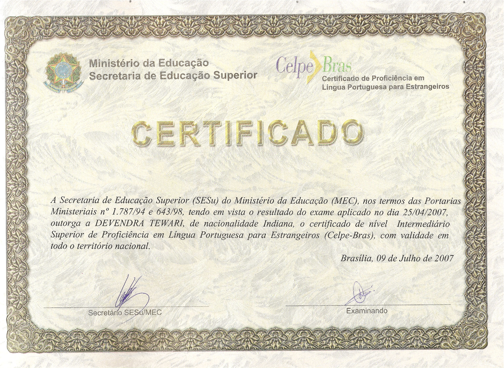

# Contacts

- [devendra.tewari@gmail.com](mailto:devendra.tewari@gmail.com)
- [GitHub](https://github.com/tewarid)
- [LinkedIn](https://www.linkedin.com/in/tewarid/)
- [Twitter](https://twitter.com/tewaridk)

# Work Experience

## Software Engineering Specialist at CESAR (2010 to Present)

Organizational activities at [CESAR](https://english.cesar.org.br) such as pre-sales and technical interviews, and projects detailed below.

### Multinational technology company (2019 to Present)

#### Embedded Linux firmware development (2020 to Present)

- HomeKit ADK integration
  - Create BitBake layer to integrate with HomeKit
  - Expose accessory services and characteristics
  - Linux, OpenEmbedded, Yocto Project, BitBake, Python, C, C++, clang, make, cmake, DBus, GLib, HomeKit ADK
- Google Voice Assistant integration
  - Integrate with on-device services
  - Add GVA to Developer SDK and firmware image
  - Test and fix performance issues
  - Linux, OpenEmbedded, Yocto Project, BitBake, Python, C, C++, clang, make, cmake, gRPC, ProtoBuf, DBus, GLib

### Firmware updater for Windows (2019 to 2020)

- Updater maintenance
  - Add support for new devices
  - Add support for new languages in installer
  - Enhance automated build system
  - C, C#, C++, InstallShield, Jenkins, USB drivers, Visual Studio 2019, Windows API, Windows Forms
- New updater application prototype
  - Over the air updates using Bluetooth RFCOMM
  - C, C#, C++, C++/CLR, C++/WinRT, Fluent Design, UWP, Visual Studio 2019, XAML

### Motorola Solutions (2010 to 2019)

#### Edge Device for Cloud Integration

- Device discovery
- Location tracking
- Web interface for device management
- Angular, Apache Kafka, ASP.NET, BitBucket, C#, CSS, Docker, HTML, JavaScript, JFrog, Jira, Microsoft Azure, Node.js, OAuth 2.0, RedHat Linux

#### UK Emergency Service Network

- Interim Provisioning Solution (IPS)
  - Active Directory, C#, Entity Framework 6, Git, GitLab, HTTP/S, Kodiak MCPTT, LDAP, SOAP 1.1, SoapUI, SQL Server, TLS 1.2, WCF, WPF

#### WAVE PTT

- Integration with Data MOTOTRBO Network Interface Service
  - C#, HTTP/S, IIS, openSIPS, SIP, TCP/TLS, UDP, WAVE 5000, WPF
- Thin Client Protocol dissector in Lua for Wireshark
- Third-party application developer support

#### Intelligent Middleware

- Intelligent Middleware ASTRO and MOTOTRBO Device Simulator
  - C#, HTTP, ONC RPC, SMTP, WebSocket, Windows Forms, XMPP
- Intelligent Middleware REST API Test Tool
  - C#, HTTP, WebSocket, Windows Forms, XMPP
- Sample code for Intelligent Middleware and WAVE 7000
  - Android, Bluetooth SPP, C#, Java, OAUTH 2, Swift, WebSocket, Windows Forms, iOS
- Speaker at APPFORUM conferences and developer workshops in the Americas and EMEA
- Brazilian Army
  - Django, Python, SIP, WebRTC

#### Documentation as Code

- Word to Markdown proof of concept
  - Custom $LaTeX$ template for Pandoc
  - Sequence charts
  - Docker image with Mermaid.js, Pandoc, and TeX Live

#### ASTRO P25

- Option Board Reference Hardware and Software
  - ATmega32U4, Altium Designer, C, C#, Fritzing, Windows Forms, Wiring
- Option Board Capture Tool
  - C#, TotalPhase Beagle USB Analyzer, Windows Forms
- Protocol dissectors in Lua for Wireshark
- Third-party application developer support

#### TETRA

- TETRA PEI Capture Tool
  - C#, TotalPhase Beagle USB Analyzer, Windows Forms
- Remote Display Control Sample Application
  - C#, Run-Length Encoding, Windows Forms
- Protocol dissectors in Lua for Wireshark
- Speaker at APPFORUM conferences in EMEA
- Third-party application developer support

#### MOTOTRBO

- Configuration Advisor Tool
  - C#, Windows Forms
- System Design Tools
  - C#, CSS, HTML, JavaScript, Windows Forms
- Generic Option Board Flash Tool
  - C#, Windows Forms
- Option Board Capture Tool
  - C#, C++, Saleae Logic Analyzer, Windows Forms
- Generic Option Board Fixture
  - Altium PCB Designer
- Site Survey Tool
  - Android, C#, Windows Forms, Xamarin
- Protocol dissectors in Lua for Wireshark
- Sample Applications
  - Arduino, Atmel AVR32, Bluetooth LE, C, C++, C#, CSS, FreeRTOS, HTML5, JavaScript, Linux, RFID, Raspberry Pi, Ruby, Sensors, Windows Forms
- Speaker at APPFORUM conferences in the Americas and EMEA
- Third-party application developer support

### Fiat Chrysler

- Development of low cost connected car mobile applications
  - Android, BeagleBoard, CAN bus, Java, Kvaser CAN Analyzer, Linux, Objective C, iOS

### Hewlett Packard Labs

- Distance education application with multi-modal interactions for HP Labs, Bangalore
  - C, GStreamer, JavaScript, Linux, Node, Raspberry Pi

## Software Development Supervisor at Modular Mining Systems (2008 to 2010)

Development of ProVision™ shovel machine guidance system

- Bucket Positioning System
  - C#, Inclinometers, Tilt Sensors
- Surface Raster to Triangulated Irregular Network
  - C#, Excel 3D Charts
- Dual GPS Positioning with Differential Error Correction
  - Helmert Transformation, NMEA, Telnet, TopCon GPS, WGS84
- Performance Optimization
  - C#, SQL Server, Windows CE
- Team management

## Engineering Manager at CESAR (2007 to 2008)

- Pre-sales
- Project resource management
- Performance appraisals
- Process improvement

## Senior Software Engineer at CESAR (2002 to 2007)

- Push-To-Talk over Cellular (PoC) client for Samsung, Campinas
  - ARM, C, CVS, Eclipse, IMS, Java, Linux, Mantis Bug Tracker, OMA PoC, SIP/SDP, SQL, XML, XCAP

- J2ME Games for LGE
  - CVS, Eclipse, Java, Tile Studio

- OSGi R4 TCK for IBM
  - Eclipse, Java, OSGi

- Pre-sales Application for Embraer, SJC
  - 3D Modeling, Apache FOP, Apache Struts 2, Bugzilla, CVS, Flash, HSQLDB, HTML, Hibernate, J2EE, Java, JavaScript, Oracle, SQL, Tomcat, Viewpoint Media Player, XSL:FO, XSLT

- Platform 2000 Development for Motorola, Campinas
  - C, C++, Java, Linux

- End to end Development for Motorola, Campinas
  - Apache Tomcat, CVS, ClearCase, J2EE, J2ME, JBoss, Java, Linux

## Senior Software Engineer at Unisys (2001 to 2002)

- Software requirements, design and development of security and access control, and other web applications
  - DB2, HTML, J2EE, Java, JavaScript, UML

## Senior Software Engineer at ITECI (2000 to 2001)

- Web applications, Storm Consulting, London
  - HTML, JavaScript, VB 6, XSLT

- LINC II Course Instructor, Bompreço, Recife

- XML Course Instructor, BCP, Recife

- Java Course Instructor

- Banking applications for Caixa Economica Federal, Brasilia
  - ASP, Erwin, HTML, Java, JavaScript, Linux, PHP, SAP Sybase PowerDesigner, SQL Server, VB 6

- Financial application for Banco Opportunity, Rio
  - ASP, SQL Server, VB 6, Windows

## Software Engineer at Enfase (1998 to 2000)

- Banking Applications, Bandepe
  - COBOL, LINC II, SQL Server, Unisys A Series, VB 6, Windows, XGEN

- Client-server application, Frigorífico Ibérico
  - Crystal Reports, SQL Server, VB 6, Windows NT

## Software Engineer at Tata Infotech/Unisys (1996 to 1998)

- Year 2000 consultancy at Toysrus (New Jersey), Bompreço (Recife), and Bancafé (Bogota)
  - ALGOL, C, COBOL, LINC II, Unisys A Series, XGEN
- DMS II course instructor
- COBOL 74 course instructor

## Student Instructor at RAIT (1995)

- Organizer of TECHNOVATE 1996
- Organizer of C programming workshop
- C programming course instructor

# Education and Courses

- **WAVE Certified Integration Engineer**, 2018, Motorola Solution
- **Xamarin Forms: Build Native Cross-platform Apps with C#**, 2018, Udemy
- **Algorithms I**, 2017, by Princeton University on Coursera
- **[Machine Learning](#machine-learning)**, 2017, by Stanford University on Coursera
- **New Trainee Program**, 1996, Tata Unisys
- **Bachelor of Engineering in Electronics**, 1992-1996, RAIT, University of Mumbai

# Languages

- English
- French (studied at school, lack fluency)
- Hindi
- [Portuguese](#portuguese-proficiency)
- Spanish (studied when living in Colombia, lack fluency)

# Attachments

## Machine Learning

Follow link to see [grade achieved](https://www.coursera.org/account/accomplishments/records/77XZA7ANSSHL).

## Portuguese Proficiency

