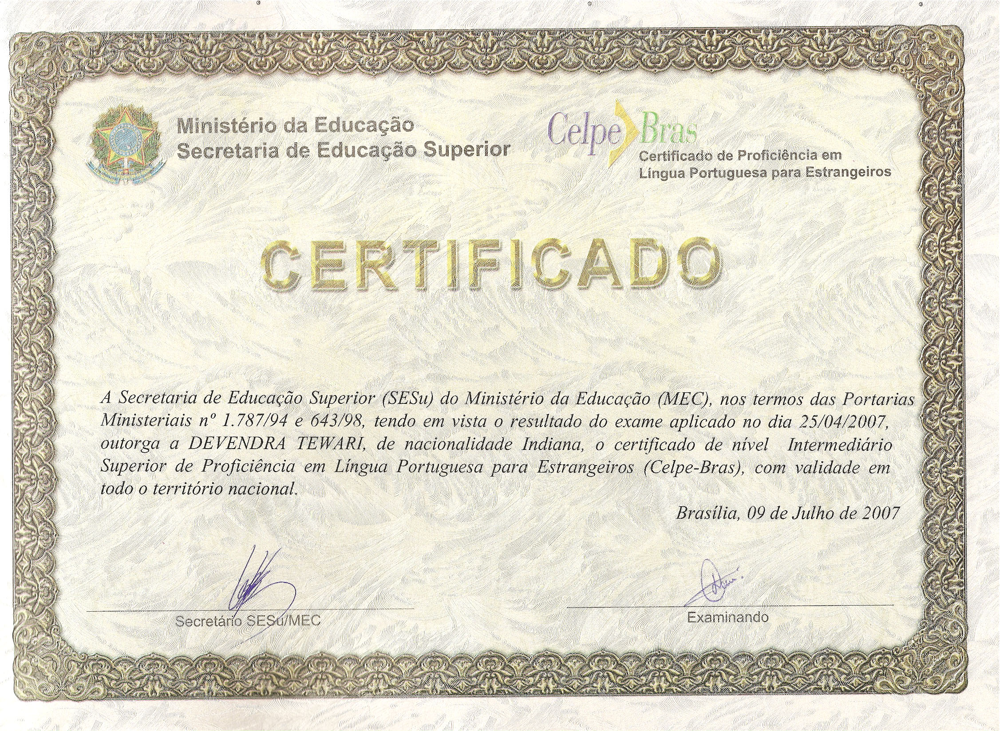
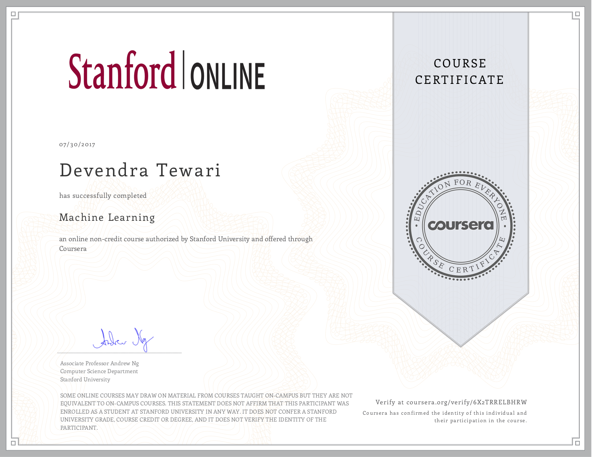

# Work Experience

## Software Engineering Specialist at CESAR (2010 to Present)

### Motorola Solutions

#### WAVE 5000 / ONCLOUD

- Data MOTOTRBO™ Network Interface Service integration
  - C#, HTTP/S, IIS, openSIPS, SIP, TCP/TLS, UDP, WAVE 5000, WPF
- Third-party application developer support
- Thin Client Protocol dissector in Lua for Wireshark

#### Emergency Service Network (ESN)

- Interim solution to provision Subscriber Identity Modules (SIMs) on UK’s ESN
  - Active Directory, C#, Entity Framework 6, Git, GitLab, HTTP/S, SOAP 1.1, SoapUI, SQL Server, TLS 1.2, WCF, WPF

#### Documentation as Code

- Word to Markdown proof of concept
  - Custom $LaTeX$ template for Pandoc
  - Sequence charts
  - Docker image with Mermaid.js, Pandoc, and TeX Live

#### Intelligent Middleware

- Intelligent Middleware Device Simulator
  - C#, HTTP, ONC RPC, SMTP, WebSocket, Windows Forms, XMPP
- Intelligent Middleware REST API Test Tool
  - C#, HTTP, WebSocket, Windows Forms, XMPP
- Sample code for Intelligent Middleware and WAVE 7000
  - Android, Bluetooth SPP, C#, Java, OAUTH 2, Swift, WebSocket, Windows Forms, iOS
- Speaker at APPFORUM conferences and developer workshops in the Americas and EMEA
- Brazilian Army
  - Django, Python, SIP, WebRTC

#### APX™

- Third-party application developer support
- Option Board Reference Hardware and Software
  - ATmega32U4, Altium Designer, C, C#, Fritzing, Windows Forms, Wiring
- Option Board Capture Tool
  - C#, TotalPhase Beagle USB Analyzer, Windows Forms
- Wireshark Dissectors in Lua

#### DIMETRA™

- Third-party application developer support
- Speaker at APPFORUM conferences in EMEA
- TETRA PEI Capture Tool
  - C#, TotalPhase Beagle USB Analyzer, Windows Forms
- Remote Display Control Sample Application
  - C#, Run-Length Encoding, Windows Forms
- Protocol dissectors in Lua for Wireshark

#### MOTOTRBO™

- Third-party application developer support
- Speaker at APPFORUM conferences in the Americas and EMEA
- System Design Tools
  - C#, CSS, HTML, JavaScript, Windows Forms
- Sample code
  - Arduino, Bluetooth LE, C#, CSS, HTML5, JavaScript, Linux, RFID, Raspberry Pi, Ruby, Sensors, Windows Forms
- Generic Option Board Fixture
  - Altium PCB Designer
- Sample code for the Generic Option Board
  - Atmel AVR32, C, C#, FreeRTOS, Windows Forms
- Configuration Advisor Tool
  - C#, Windows Forms
- Generic Option Board Flash Tool
  - C#, Windows Forms
- Option Board Capture Tool
  - C#, C++, Saleae Logic Analyzer, Windows Forms
- Site Survey Tool
  - Android, C#, Windows Forms, Xamarin
- Protocol dissectors in Lua for Wireshark

### Fiat Chrysler

- Development of low cost connected car mobile applications
  - Android, BeagleBoard, CAN bus, Java, Kvaser CAN Analyzer, Linux, Objective C, iOS

### Hewlett Packard Labs

- Distance education application with multi-modal interactions for HP Labs, Bangalore
  - C, GStreamer, JavaScript, Linux, Node, Raspberry Pi

## Software Development Supervisor at Modular Mining Systems (2008 to 2010)

Development of ProVision™ shovel machine guidance system

- Bucket Positioning System
  - C#, Inclinometers, Tilt Sensors
- Surface Raster to Triangulated Irregular Network
  - C#, Excel 3D Charts
- Dual GPS Positioning with Differential Error Correction
  - Helmert Transformation, NMEA, Telnet, TopCon GPS, WGS84
- Performance Optimization
  - C#, SQL Server, Windows CE
- Team management

## Engineering Manager at CESAR (2007 to 2008)

- Pre-sales
- Project resource management
- Performance appraisals
- Process improvement

## Senior Software Engineer at CESAR (2002 to 2007)

- Push-To-Talk over Cellular (PoC) client for Samsung, Campinas
  - ARM, C, CVS, Eclipse, IMS, Java, Linux, Mantis Bug Tracker, OMA PoC, SIP/SDP, SQL, XML, XCAP

- J2ME Games for LGE
  - CVS, Eclipse, Java, Tile Studio

- OSGi R4 TCK for IBM
  - Eclipse, Java, OSGi

- Pre-sales Application for Embraer, SJC
  - 3D Modeling, Apache FOP, Apache Struts 2, Bugzilla, CVS, Flash, HSQLDB, HTML, Hibernate, J2EE, Java, JavaScript, Oracle, SQL, Tomcat, Viewpoint Media Player, XSL:FO, XSLT

- Platform 2000 Development for Motorola, Campinas
  - C, C++, Java, Linux

- End to end Development for Motorola, Campinas
  - Apache Tomcat, CVS, ClearCase, J2EE, J2ME, JBoss, Java, Linux

## Senior Software Engineer at Unisys (2001 to 2002)

- Security and Access Control application for SEFAZ-PE
  - DB2, HTML, J2EE, Java, JavaScript, UML

## Senior Software Engineer at ITECI (2000 to 2001)

- Web applications for Storm Consulting, London
  - HTML, JavaScript, VB 6, XSLT

- XML Course for BCP

- Banking applications for Caixa Economica Federal, Brasilia
  - ASP, Erwin, HTML, Java, JavaScript, Linux, PHP, SAP Sybase PowerDesigner, SQL Server, VB 6

- Financial application for Banco Opportunity, Rio
  - ASP, SQL Server, VB 6, Windows

## Software Engineer at Enfase (1998 to 2000)

- Banking Applications for Bandepe
  - COBOL, LINC II, SQL Server, Unisys A Series, VB 6, Windows, XGEN

- Client/Server application at Frigorifico Iberico
  - Crystal Reports, SQL Server, VB 6, Windows NT

## Software Engineer at Tata Infotech/Unisys (1996 to 1998)

- Year 2000 consultancy at Bancafe, Bogota
- Year 2000 renovation at Bompreço, Recife
  - COBOL, LINC II, Unisys A Series
- Year 2000 renovation at Toysrus, New Jersey
  - ALGOL, C, COBOL, LINC II, Unisys A Series, XGEN

# Education and Courses

- **Xamarin Forms: Build Native Cross-platform Apps with C#** 2018, Udemy
- **Algorithms I** 2017, by Princeton University on Coursera
- **[Machine Learning](#machine-learning)** June to July 2017, by Stanford University on Coursera
- **Bachelor of Engineering in Electronics** 1992 to 1996, at Ramrao Adik Institute of Technology, University of Mumbai

# Languages

- English
- Hindi
- [Portuguese](#brazilian-portuguese-proficiency)

# Attachments

## Brazilian Portuguese Proficiency

## Machine Learning

Follow link to see [grade achieved](https://www.coursera.org/account/accomplishments/records/77XZA7ANSSHL).
